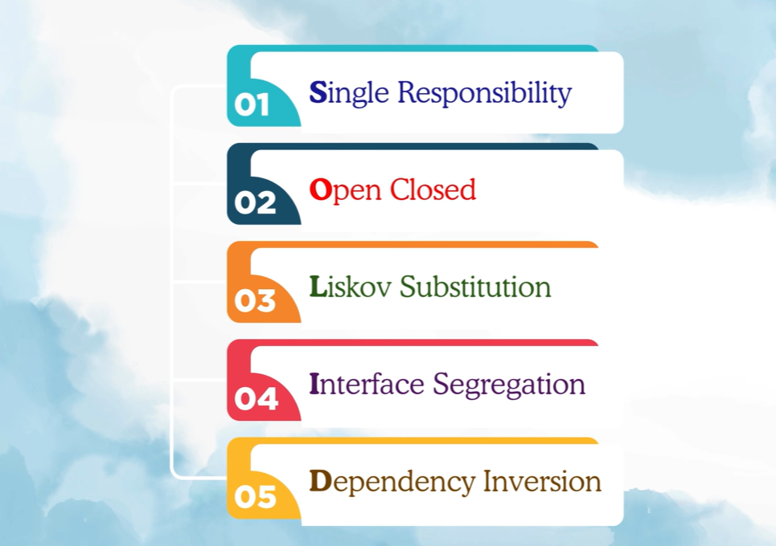

# solid-principle
SOLID principles: 
_Types:_ 
* Single Responsibility Principle (SRP), 
* Open/Closed Principle (OCP), 
* Liskov Substitution Principle (LSP), 
* Interface Segregation Principle (ISP)
* Dependency Inversion Principle (DIP)

